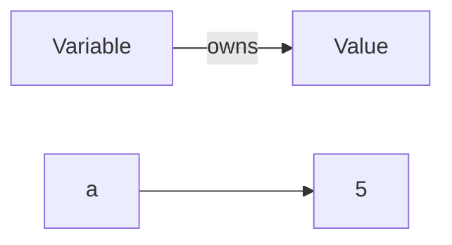
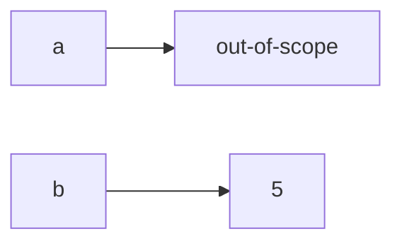

# Rust


# Ferris the crab


Unofficial mascot for Rust.

## When do developer a good job?

## When do developer a good job?
1. Deliver a functioning software (spec meet, bug-free)

## When do developer a good job?
1. Deliver a functioning software (spec meet, bug-free)
2. Maintain the delivery speed (Independent upon the code size)

# How does Rust help to do a good?

## How does Rust help to do a good?

Wait for the take away.
# Online

[Rust](https://play.rust-lang.org/)

[C](https://www.onlinegdb.com/online_c_compiler)
# Agenda

- Type Safe
- Memory Safe
- Thread Safe
- Syntatic Sugar

# Deterministic Behavior

in [C](https://onlinegdb.com/gZn9u9_CE)
```C
uint64_t a = 1 << 40;
// ? 0 or 0x10000000000
```

in [Rust](https://play.rust-lang.org/?version=stable&mode=debug&edition=2021&code=fn%20main()%20%7B%0A%20%20%20%20let%20a%20%3D%201u64%20%3C%3C%2040%3B%0A%20%20%20%20println!(%22a%20%3D%20%7B%3Ax%7D%22%2C%20a)%3B%0A%7D)
```Rust
let a = 1u64 << 40;
// definitely 0x100_0000_0000
```

Note:
- Let the compiler do as much as as possible to identify bugs
- Have the language as precise as necessary, do not allow ambiguity
- Language should be expressive in order to limit double takes

# Guarantees

## Edsger Dijkstra


## Edsger Dijkstra

- Software as mathematical structure (postulates, proofs, theorems,  )
- Idea of proof of correctness
  - abstraction
  - enumeration
  - induction
- invented structured programming (side effect)


Note:
- 1930 - 2002
- spartan lifestile
- (no tv, no cinima visit, classic music (mozart))
- small house in Nuonen (netherlands, where van Gogh lived)
- studied theoretical physics -> wanted to be come a programmer
- invented algol 60
- worked on self-stabilization of computer programs (lately)
- Reference: R.C. Margin: Clean craftsmanship p316
- [Wikipedia](https://en.wikipedia.org/wiki/Edsger_W._Dijkstra)
- known for shortest path algorithm (aka Dijkstra's algorithm)

# Type Safe

## Type System

- A type system is a logical system comprising a set of rules that assigns a property called a type to every "term".
- A type system dictates the operations that can be performed on a term.
- A an enforced type system reduces possibilities for bugs in computer programs due to type errors.
- Type safety contributes to program correctness.

Note:
- Terms are variables, functions, expressions, etc.
- Type safety is guaranteed (at compile time) for many forms of type errors.
- [Type Errors Wikipedia](https://en.wikipedia.org/wiki/Type_system#Type_errors)

## Type Errors

Type Errors are found by the type check.
Type check is the process of verifying and enforcing the constraints of types.

- At compile time (aka static type check)
  - fast and what we want
  - guarantee that a program is free of a certain set of type errors
- At run time (e.g. division by zero)
  - Need to be handled by the program code explicitly
  - Need to be verified by unit tests

- Limits the needs for source code unit tests

Note:

- **always const** aka context evaluation at compile time
- opositite **never const** aka context evaluation at runtime
- **maybe const** evalution at compile time and also at runtime (depending on the calling)
  [see](https://blog.yoshuawuyts.com/const-syntax/)

## Simple Types

## Arrays

## Structs

## Enums

## Explicit Type Conversion

## Zero cost abstractions

## Further Type capabilities

- Generic types
- Traits
- Trait objects
- Type bounds

## Result type

```Rust

struct E;

fn seven_is_an_error(n: u32) -> Result<u32, E> {
    if n == 7 {
        Err(E)
    } else {
        Ok(n)
    }
}
```
Note:
- Result is an ordinary enum data type
- Errors are modeled as types - aka data
- Language enforces error handling by the need to "open the result envelope" to get to the content

## Option type

There is no **NULL** or **None**, of **nil** for any data that does not exist.
But there is an Option.

```Rust
let a: Option<u32> = Some(42);
leb b: Option<u32> = None;
if a != b {
    println!("42 is different from nothing");
}
```

Note:
- Option is an ordinary enum data type
- No programming accidents by forgetting check of none existence, emptiness
- Many convenient functions in std lib

# Memory Safety

## Ownership

```rust
let a = 5_usize;
```



## Ownership transfer

```rust
let b = a;
```



## Imuatable borrowing

```rust
let a = 5_usize;
let b = &a;
let c = &b;
println!("(a, b, c) = ({:?}, {:?}, {:?})", a, b, c);
/// (a, b, c) = (5, 5, 5)
```

## Mutable borrowing

```rust
let mut a = 5_usize;
{
    let b = &mut a;  // a mutably borrows its value to b
    *b += 1;   // a has not access to the value here
} // b goes out of scope here
  // therefore borrowing ends here as well
println!("a = {:?}", a);
//  a = 6
```

Note:
- References have lifetime
- Lifetime of a reference is not longer than lifetime of the underlying variable
- Ownership, borrowing, lifetime as usual **checked at compile time**
```

## Memory Safety @ embedded

Peripherals treated as memory with ownership

- Access checked at compile time
- **No CPU memory protection management at runtime needed**

# Thread Safety

- as usual **checked at compile time**
- handover of variables via move or copy (delegated to ownership)
- shared data/memory/resources via arc + mutex + refcell/cell
- message queues (mpsc)

Note:
- in embedded thread multiple tasks.
# Syntatic Sugar

In computer science, syntactic sugar is syntax within a programming language that is designed to make things easier to read or to express.

Note:
Desugaring is something that the compiler does, to reduce the syntax to a canonical expression.
E.g. `a += b` (sugar) maps to `a = a + b` (desugar)

## Type deduction

[show compiler in action](https://play.rust-lang.org/?version=stable&mode=debug&edition=2021&code=fn%20main()%20%7B%0A%20%20%20%20let%20a%20%3D%20%5B%201_u8%2C%202_u8%2C%203_u16%5D%3B%0A%20%20%20%20println!(%22a%20%3D%20%7B%3A%3F%7D%22%2C%20a)%3B%0A%20%20%20%20let%20b%20%3D%20if%20a%5B0%5D%20%3D%3D%20a%5B1%5D%20%7B%0A%20%20%20%20%20%20%20%20Some(1.0_f32)%20%2F%2F%20None%0A%20%20%20%20%7D%20else%0A%20%20%20%20%7B%0A%20%20%20%20%20%20%20%20Some(256_u16)%0A%20%20%20%20%7D%3B%0A%20%20%20%20println!(%22b%20%3D%20%7B%3A%3F%7D%22%2C%20b)%3B%0A%7D)
```rust
let a /* : [u8;2] */ = [ 1_u8, 2_u8];
let b = if a[0] == a[1] {
    None
} else {
    Some(256_u16)
};
let c;
{
    c = 3_000isize;
}
```

## Result type handling (1)

[basic handling](https://play.rust-lang.org/?version=stable&mode=debug&edition=2021&code=struct%20E%3B%0A%0Afn%20seven_is_an_error(n%3A%20u32)%20-%3E%20Result%3Cu32%2C%20E%3E%20%7B%0A%20%20%20%20if%20n%20%3D%3D%207%20%7B%0A%20%20%20%20%20%20%20%20Err(E)%0A%20%20%20%20%7D%20else%20%7B%0A%20%20%20%20%20%20%20%20Ok(n)%0A%20%20%20%20%7D%0A%7D%0A%0Afn%20process_number(n%3A%20u32)%20%7B%0A%20%20%20%20match%20seven_is_an_error(n)%20%7B%0A%20%20%20%20%20%20%20%20Ok(x)%20%3D%3E%20println!(%22Successfully%20processed%20%7B%3A%3F%7D%22%2C%20x)%2C%0A%20%20%20%20%20%20%20%20Err(_e)%20%3D%3E%20println!(%22Cannot%20process%20invalid%20number%22)%0A%20%20%20%20%7D%3B%0A%7D%0A%0Afn%20main()%20%7B%0A%20%20%20%20process_number(3)%3B%0A%20%20%20%20process_number(7)%3B%0A%20%20%20%20process_number(15)%3B%0A%7D)
```Rust
fn process_number(n: u32) {
    match seven_is_an_error(n) {
        Ok(x) => println!("Successfully processed {:?}", x),
        Err(_e) => println!("Cannot process invalid number")
    };
}

```

## Result type handling (2)

[Error Chaining](https://play.rust-lang.org/?version=stable&mode=debug&edition=2021&code=%23%5Bderive(Debug)%5D%0Astruct%20E%3B%0A%0Afn%20seven_is_an_error(n%3A%20u32)%20-%3E%20Result%3Cu32%2C%20E%3E%20%7B%0A%20%20%20%20if%20n%20%3D%3D%207%20%7B%0A%20%20%20%20%20%20%20%20Err(E)%0A%20%20%20%20%7D%20else%20%7B%0A%20%20%20%20%20%20%20%20Ok(n)%0A%20%20%20%20%7D%0A%7D%0A%0Afn%20process_number(n%3A%20u32)%20-%3E%20Result%3Cu32%2C%20E%3E%20%7B%0A%20%20%20%20seven_is_an_error(n)%3F%3B%0A%20%20%20%20seven_is_an_error(n)%3F%3B%0A%20%20%20%20Ok(n)%20%0A%7D%0A%0Afn%20main()%20%7B%0A%20%20%20%20println!(%22process%203%20and%20get%3A%20%7B%3A%3F%7D%22%2C%20process_number(3).unwrap())%3B%0A%20%20%20%20println!(%22process%207%20and%20get%3A%20%7B%3A%3F%7D%22%2C%20process_number(7))%3B%0A%7D)

```Rust
fn process_number(n: u32) -> Result<u32, E> {
    seven_is_an_error(n)?;
    eight_is_an_error(n)?;
    Ok(n)
}
```

## Initialization

[Structs](https://play.rust-lang.org/?version=stable&mode=debug&edition=2021&code=%0Astruct%20S%20%7B%0A%20%20%20%20pub%20a%3A%20u8%2C%0A%20%20%20%20pub%20b%3A%20bool%2C%0A%7D%0A%0Afn%20main()%20%7B%0A%20%20%20%20let%20_x%20%3D%20S%20%7B%20a%3A%201%2C%20b%3A%20false%20%7D%3B%0A%20%20%20%20let%20a%20%3D%203%3B%0A%20%20%20%20let%20b%20%3D%20true%3B%0A%20%20%20%20let%20y%20%3D%20S%20%7Ba%2C%20b%7D%3B%0A%20%20%20%20println!(%22y%20%3D%20%7B%7D%2C%20%7B%7D%22%2C%20y.a%2C%20y.b)%3B%0A%7D%0A)
```Rust
struct S {
    pub a: u8,
    pub b: bool,
}

let _x = S { a: 1, b: false };
let a = 3;
let b = true;
let y = S {a, b};
println!("y = {}, {}", y.a, y.b);

```


## Macros

- asn1 operation
- more powerful than C / C++

```Rust
println!("foo {:?}", some_struct );
info!("Log info);
todo!("I have not done this);
panic!("Crash with backtrace on purpose");
```


# Module concept

## Modules

- namespace
- no header source files
- one file describes one or many modules
- hierarchical
  - unambiguous mapping between modules and files/directories


## Crates

- collection of modules
- global name,
- one public global regisstry/artifact server [crates.io](https://crates.io)
- Subject of reuse `cargo.toml`
  - dependency management
  - feature management
- e.g. [Manchester Code](https://crates.io/crates/manchester-code)

## cargo.toml

```toml

```


## Interfaces modules

- public/ private
- Type declarations
- Trait delcarations
- subject to reuse e.g. [embedded-hal](https://crates.io/crates/embedded-hal)
  - no vendor lock
  - community maintained

Note:
- reuse release equivalence principle
- semantic versioning

# Baterries included

## rustup

- install/ upgrade /switch compiler/ standard library
- manage targets (host, cross, webassembly)
- bootstrap your environment

## cargo build

- Build: `cargo build`
- Test `cargo test`
- Run `cargo run -- executable parameters`
- In the loop: `cargo watch -x test`

- Customizeable via `cargo.toml, `build.rs`

Note:
- there is nothing else but cargo.toml
- all dependency mng is there!!!
- cargo extension to bump version
- programmatic access to cargo.toml information
- build.rs needed to bridge to ffi, etc.
- cargo extension for embedded / flashing objcopy, etc.


## cargo other

- fmt
- clippy
- new
- lic check / sbom
- dependency management

## rustdoc

- Dostring convineance
  
```rust
/// This is a docstring
/// and syntactic sugar with markdown formatting supported
/// including code examples and graphics (e.g. mermaid)
#[doc]  // this is the "desugared" doc directive
```

All documented at: [https://docs.rs](https://docs.rs)

```sh
cargo doc
```


## unit tests

```rust
#[cfg(test)]
mod tests {
    use super::*;

    #[test]
    fn any_test_func() {
      assert_eq!(1, 2)
```

```sh
cargo test
```

## bdd integration

## crates

[crates.io](https://crates.io)

```sh
cargo publish
```

Manchester Encoding: [Crate](https://crates.io/crates/manchester-code) [Source](https://github.com/almedso/manchester-code) [doc](https://docs.rs/manchester-code/0.2.0/manchester_code/)

---

# Take aways
## Take aways
- Zero Cost Abstractions -> High performance
## Take aways
- Zero Cost Abstractions -> High performance
- Type, Memory & Thread Safety - High functional correctness
## Take aways
- Zero Cost Abstractions -> High performance
- Type, Memory & Thread Safety - High functional correctness
- Syntactic sugar, doc and test - Easy maintainability
## Take aways
- Zero Cost Abstractions -> High performance
- Type, Memory & Thread Safety - High functional correctness
- Syntactic sugar, doc and test - Easy maintainability
- Batteries included - Ease of integration
## Take aways
- Zero Cost Abstractions -> High performance, correctness, maintainability
- Type, Memory & Thread Safety - High functional correctness
- Syntactic sugar, doc and test - Easy maintainability
- Batteries included - Ease of integration
- Module and crate system - Easy maintainability and reuse

# Areas of Application

- Embedded, system programming, application services,
- Webassembly, data science, machine learning
- Not for prototyping
- Mixed environments: Language bindings via ffi/unsafe code


# Disadvantages

- Steep learning curve
  *You argue with the compiler for hours and finally the compiler accepts and
  all of a sudden the code works and is already clean*
- No certified compiler yet.

# Advantages

- You can focus on the right abstraction for the problem to solve.
- No waste of time in build tooling, configuration management, SCA,
  complicated test frameworks, dis-functional documentation.
- One community driven evolutionary style guide that can be enforced
  cargo

# Not touched

- all language features
  - (e.g. async await, iterators, streams, memory management, ...)
- Rust Foundation activities
  - Cybersecurity working group
  - Compiler evolution
